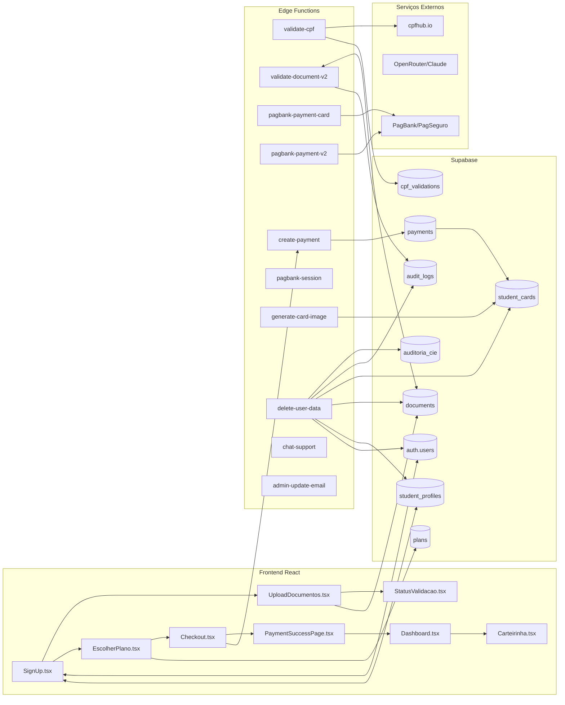

# Projeto URE Brasil – Documentação Técnica Completa

## Table of Contents

1. [Visão Geral do Sistema](#1-visão-geral-do-sistema)  
   1.1 [Descrição do produto](#11-descrição-do-produto)  
   1.2 [Arquitetura geral](#12-arquitetura-geral)  
   1.3 [Stack tecnológica](#13-stack-tecnológica)  
   1.4 [Ambientes](#14-ambientes)  

2. [Banco de Dados (Supabase)](#2-banco-de-dados-supabase)  
   2.1 [auth.users](#21-authusers)  
   2.2 [student_profiles](#22-student_profiles)  
   2.3 [student_cards](#23-student_cards)  
   2.4 [payments](#24-payments)  
   2.5 [documents](#25-documents)  
   2.6 [plans](#26-plans)  
   2.7 [cpf_validations](#27-cpf_validations)  
   2.8 [auditoria_cie](#28-auditoria_cie)  
   2.9 [audit_logs](#29-audit_logs)  

3. [Edge Functions (Supabase)](#3-edge-functions-supabase)  
   3.1 [validate-cpf](#31-validate-cpf)  
   3.2 [validate-document-v2](#32-validate-document-v2)  
   3.3 [pagbank-payment-v2](#33-pagbank-payment-v2)  
   3.4 [pagbank-payment-card](#34-pagbank-payment-card)  
   3.5 [create-payment](#35-create-payment)  
   3.6 [pagbank-session](#36-pagbank-session)  
   3.7 [generate-card-image](#37-generate-card-image)  
   3.8 [delete-user-data](#38-delete-user-data)  
   3.9 [chat-support](#39-chat-support)  
   3.10 [admin-update-email](#310-admin-update-email)  
   3.11 [cleanup-rejected-documents](#311-cleanup-rejected-documents)  
   3.12 [compare-faces](#312-compare-faces)  

4. [Stored Procedures & Triggers](#4-stored-procedures--triggers)  
   4.1 [create_student_card_on_payment()](#41-create_student_card_on_payment)  
   4.2 [activate_student_card_on_docs_approved()](#42-activate_student_card_on_docs_approved)  
   4.3 [check_cpf_exists() / check_phone_exists()](#43-check_cpf_exists--check_phone_exists)  
   4.4 [cleanup_expired_cpf_validations()](#44-cleanup_expired_cpf_validations)  
   4.5 [mark_payment_as_anonymized()](#45-mark_payment_as_anonymized)  
   4.6 [trigger_validate_document()](#46-trigger_validate_document)  
   4.7 [trigger_compare_faces()](#47-trigger_compare_faces)  
   4.8 [Triggers auxiliares](#48-triggers-auxiliares)  

5. [Fluxos Principais](#5-fluxos-principais)  
   5.1 [Cadastro de usuário](#51-cadastro-de-usuário)  
   5.2 [Pagamento digital (plano principal)](#52-pagamento-digital)  
   5.3 [Upsell de carteirinha física](#53-upsell-física)  
   5.4 [Upload e validação de documentos](#54-upload-documentos)  
   5.5 [Exclusão LGPD](#55-exclusão-lgpd)  

6. [Integrações Externas](#6-integrações-externas)  
   6.1 [PagBank / PagSeguro](#61-pagbank--pagseguro)  
   6.2 [OpenRouter / Claude](#62-openrouter--claude)  
   6.3 [API CPF (cpfhub.io)](#63-api-cpf-cpfhubio)  

7. [Segurança & Compliance](#7-segurança--compliance)  

8. [Problemas Conhecidos & Soluções](#8-problemas-conhecidos--soluções)  

9. [Pendências & Melhorias Futuras](#9-pendências--melhorias-futuras)  

10. [Guia de Manutenção](#10-guia-de-manutenção)  


---

## 1. Visão Geral do Sistema

### 1.1 Descrição do produto

- Plataforma de emissão de **carteirinhas estudantis digitais e físicas** (geral e Direito).
- Fluxo completo:
  - Cadastro e validação de identidade (CPF + documentos com IA).
  - Pagamento de plano digital (com opção de upsell para física).
  - Geração de carteirinha digital (QR code dinâmico + imagem estática).
  - Controle de impressão/envio de carteiras físicas.
  - Mecanismo de exclusão de dados conforme **LGPD**.

### 1.2 Arquitetura geral

**Visão em alto nível (Mermaid):**



**Pontos críticos (⚠️) e boas práticas (✅):**

- ⚠️ Pagamentos dependem de Edge Functions com **service role**; qualquer vazamento de chave é crítico.
- ✅ Uso extensivo de **RLS** para isolar dados por usuário.
- ✅ CPF e documentos sensíveis possuem **hash / mascaramento** e histórico em `audit_logs` / `auditoria_cie`.

### 1.3 Stack tecnológica

- **Frontend**
  - React + TypeScript (`src/`)
  - Vite + Tailwind + componentes shadcn UI (pasta `src/components/ui`)
  - Supabase JS client (auth e queries)
- **Backend**
  - Supabase (Postgres, Auth, Storage, Edge Functions em Deno)
  - Funções SQL e triggers para orquestração (pagamento → carteirinha; documentos → ativação)
- **Integrações**
  - PagBank / PagSeguro (XML v3, API REST v2)
  - OpenRouter / Claude para validação documental (via `validate-document-v2`)
  - cpfhub.io para validação e cache de CPF

### 1.4 Ambientes

- **Dev / Sandbox**
  - Supabase projeto: `nwszukpenvkctthbsocw` (em `supabase-novo/config.toml`)
  - PagBank: sandbox (`PAGBANK_MODE=sandbox` / `PAGBANK_SANDBOX_KEY`)
- **Prod**
  - Supabase projeto: `zyfbxzjfpncxfawthsht` (em `ure-brasil-carteirinhas/supabase/config.toml`)
  - PagBank: modo `prod` com `PAGBANK_PROD_KEY`
- Frontend:
  - Build Vercel (vercel.json).
  - Dev local rodando via `npm run dev` na porta 8080.<mccoremem id="03fdhs2mtluug9ldd8xy4aunh" /></mccoremem>


---

## 2. Banco de Dados (Supabase)

### 2.1 auth.users

**Propósito:**  
Tabela gerenciada pelo Supabase Auth com credenciais dos usuários.

- **Principais colunas (padrão Supabase):**
  - `id` (uuid, PK)
  - `email`, `email_confirmed_at`
  - `phone`, `phone_confirmed_at`
  - `created_at`, `last_sign_in_at`, `raw_app_meta_data`, `raw_user_meta_data`
- **Relacionamentos:**
  - `student_profiles.user_id` → `auth.users.id`
  - `audit_logs` e outras funções usam `auth.uid()` para RLS.
- **RLS:**
  - RLS do schema `auth` foi desabilitado e reconfigurado por migrações específicas (ex.: `20260115161314_disable_rls_auth_users.sql`), para permitir controle via `auth.admin`.

---

### 2.2 student_profiles

Definição em  
[`20260115213044_import_public_schema.sql`](file:///D:/!Vendatto/URE/CarteirinhaURE/supabase-novo/supabase/migrations/20260115213044_import_public_schema.sql#L860-L890):

**Propósito:** Dados cadastrais do estudante, 1–1 com `auth.users`.

**Colunas principais:**

- `id` (uuid, PK, default `uuid_generate_v4()`)
- `user_id` (uuid, FK → auth.users.id, unique)
- `full_name` (varchar(255), NOT NULL)
- `cpf` (varchar(14), NOT NULL, UNIQUE, índice `idx_student_profiles_cpf`)
- `rg` (varchar(20))
- `birth_date` (date, NOT NULL)
- `phone` (varchar(20), NOT NULL, UNIQUE)
- Endereço:
  - `cep` (varchar(9)), `street`, `number`, `complement`, `neighborhood`, `city`, `state`
- Dados acadêmicos:
  - `institution`, `course`, `period`, `enrollment_number`
- Plano:
  - `plan_id` (uuid, FK → plans.id)
- Estado de cadastro:
  - `profile_completed` (boolean, default false)
- Termos:
  - `terms_accepted` (boolean, default false)
  - `terms_accepted_at` (timestamptz)
  - `terms_ip_address` (inet)
  - `terms_version` (varchar(10), default '1.0')
- Imagem/IA:
  - `avatar_url` (text)
  - `is_law_student` (boolean, default false, derivado por trigger de curso)
  - `face_validated` (boolean, default false, usado na comparação de rosto)
  - `profile_photo_url` (text)
- Auditoria:
  - `created_at`, `updated_at` (timestamptz, default now)

**Índices:**

- `idx_student_profiles_cpf` (CPF)
- `idx_student_profiles_user_id` (user_id)

**RLS & Policies (trecho do schema):**

- `Users can view their own profile`
  - SELECT: `auth.uid() = user_id`
- `Users can update their own profile`
  - UPDATE: `auth.uid() = user_id`
- `Users can insert their own profile`
  - INSERT: `auth.uid() = user_id`
- `Admins can view/update all profiles`
  - SELECT/UPDATE com checagem via `has_any_role(auth.uid(), ['admin','manager'])`.

**Triggers relevantes:**

- `update_student_profiles_updated_at`
  - BEFORE UPDATE: atualiza `updated_at`.
- `on_course_update` / `detect_law_student`
  - Ao alterar `course`, seta `is_law_student` para perfis de Direito.

---

### 2.3 student_cards

Definição em  
[`20260115213044_import_public_schema.sql`](file:///D:/!Vendatto/URE/CarteirinhaURE/supabase-novo/supabase/migrations/20260115213044_import_public_schema.sql#L826-L845):

**Propósito:** Registro de carteirinhas emitidas (digital e física) por pagamento.

**Colunas principais:**

- `id` (uuid, PK)
- `student_id` (uuid, FK → student_profiles.id, ON DELETE CASCADE)
- `payment_id` (uuid, FK → payments.id, UNIQUE)
- `card_number` (varchar(50), UNIQUE)
- `qr_code` (text, pode ser string simples ou JSON serializado)
- `card_type` (`public.card_type` – enum, ex.: `geral`, `direito`)
- `status` (`public.card_status`, default `'pending_docs'`)
  - Estados típicos: `pending_docs`, `active`, possivelmente `blocked`, etc.
- `issued_at` (timestamptz)
- `valid_until` (date)
- `digital_card_url` (text, imagem estática após geração)
- Física:
  - `is_physical` (boolean, default false)
  - `shipping_status` (`public.shipping_status`)
  - `shipping_code` (tracking)
  - `shipped_at`, `delivered_at`
- Auditoria:
  - `created_at`, `updated_at`
- `usage_code` (varchar(9), UNIQUE) – código curto para verificação.
- `static_image_url` (text) – URL da imagem renderizada.

**Índices:**

- `idx_student_cards_status` (status)
- `idx_student_cards_student_id` (student_id)
- Unique:
  - `student_cards_card_number_key`
  - `student_cards_payment_id_unique`
  - `student_cards_usage_code_key`

**RLS & Policies:**

- `Users can view their own cards`
  - SELECT: `student_id IN (SELECT id FROM student_profiles WHERE user_id = auth.uid())`
- `Admins can manage all cards`
  - SELECT/UPDATE/... com `has_any_role(auth.uid(), ['admin', 'manager'])`.

---

### 2.4 payments

Definição em  
[`20260115213044_import_public_schema.sql`](file:///D:/!Vendatto/URE/CarteirinhaURE/supabase-novo/supabase/migrations/20260115213044_import_public_schema.sql#L794-L815):

**Propósito:** Log de pagamentos (digital principal e upsell) com metadados do gateway.

**Colunas principais:**

- Identificação:
  - `id` (uuid, PK)
  - `student_id` (uuid, FK → student_profiles.id, ON DELETE CASCADE)
  - `plan_id` (uuid, FK → plans.id)
- Financeiro:
  - `amount` (numeric(10,2)) – valor em reais
  - `payment_method` (`public.payment_method`, enum Pix / Cartão)
  - `status` (`public.payment_status`, default `'pending'`)
  - `installments` (int, default 1)
- PIX:
  - `pix_qr_code`, `pix_code`, `pix_expires_at`, `pix_receipt_url`, `pix_qr_code_base64`
- Cartão:
  - `card_last_digits` (varchar(4))
  - `card_brand` (varchar(50))
- Gateway:
  - `gateway_charge_id` (varchar(100), UNIQUE)
  - `gateway_reference_id` (varchar(100)) – **foi ajustado para VARCHAR, ver seção 8**
  - `gateway_name` (varchar(50))
- Metadados:
  - `metadata` (jsonb) – inclui `is_upsell: true`, `original_payment_id`, etc.
- Auditoria:
  - `created_at`, `updated_at`
  - `confirmed_at` (timestamptz)

**Índices / Constraints:**

- PK em `id`
- FK para `student_profiles`, `plans`
- RLS:
  - `Users can view their own payments`
  - `Users can insert their own payments`
  - `Admins can manage all payments`.

---

### 2.5 documents

Definição em  
[`20260115213044_import_public_schema.sql`](file:///D:/!Vendatto/URE/CarteirinhaURE/supabase-novo/supabase/migrations/20260115213044_import_public_schema.sql#L767-L783):

**Propósito:** Documentos enviados (RG, foto 3x4, selfie, comprovante de matrícula, etc.) para validação automatizada + humana.

**Colunas principais:**

- `id` (uuid, PK)
- `student_id` (uuid, FK → student_profiles.id, ON DELETE CASCADE)
- `type` (`public.document_type` – enum, ex.: `rg`, `foto`, `selfie`, `comprovante`)
- Arquivo:
  - `file_url` (text, caminho no storage)
  - `file_name` (varchar(255))
  - `file_size` (int)
  - `mime_type` (varchar(100))
- Validação:
  - `status` (`public.document_status`, default `'pending'`)
  - `validated_by` (uuid → auth.users.id)
  - `validated_at` (timestamptz)
  - `rejection_reason` (text)
  - `rejection_reason_id` (uuid → rejection_reasons.id)
  - `rejection_notes` (text)
  - `validation_confidence` (int, saída de IA)
- Auditoria:
  - `created_at`, `updated_at`

**Índices:**

- `idx_documents_status` (status)
- `idx_documents_student_id` (student_id)
- UNIQUE (student_id, type) – garante um documento por tipo/aluno.

**RLS:**

- `Users can view their own documents`
- `Users can insert their own documents`
- `Users can update their own pending or rejected documents`.
- `Admins can manage all documents`.

---

### 2.6 plans

Definição em  
[`20260115213044_import_public_schema.sql`](file:///D:/!Vendatto/URE/CarteirinhaURE/supabase-novo/supabase/migrations/20260115213044_import_public_schema.sql#L1079-L1089):

**Propósito:** Planos de carteirinha, origem de preços e tipo (digital/física, geral/direito).

**Colunas:**

- `id` (uuid, PK)
- `type` (`public.card_type`, enum)
- `name` (varchar(100))
- `description` (text)
- `price` (numeric(10,2)) – valor base
- `is_physical` (boolean, default false)
- `is_direito` (boolean, default false)
- `is_active` (boolean, default true)
- `created_at`, `updated_at`

**RLS:**

- `Anyone can view active plans` (SELECT `WHERE is_active = true`)
- `Admins can manage plans` (insert/update/delete).

---

### 2.7 cpf_validations

**Não há CREATE TABLE explícito no dump incluído, mas a estrutura é inferida pela function `validate-cpf`.**

Usada em  
[`validate-cpf/index.ts`](file:///D:/!Vendatto/URE/CarteirinhaURE/ure-brasil-carteirinhas/supabase/functions/validate-cpf/index.ts#L142-L193):

**Propósito:** Cache de consultas de CPF na API externa, a partir de hash do CPF, para reduzir custo e latência.

**Colunas inferidas:**

- `cpf_hash` (text, chave derivada via SHA-256 do CPF)
- `name` (text)
- `birth_date` (text ou date) – conforme retorno da API
- `validated_at` (timestamptz)
- `expires_at` (timestamptz) – usado no filtro `gt("expires_at", now)`
- `updated_at` (timestamptz)
- Provável `created_at`.

**Uso:**

- SELECT onde `cpf_hash = :hash` e `expires_at > now`.
- UPDATE estende `expires_at` por mais 72h a cada uso.
- INSERT na primeira validação bem-sucedida.

---

### 2.8 auditoria_cie

**Não há CREATE TABLE no dump visível, mas a estrutura é inferida em  
[`delete-user-data/index.ts`](file:///D:/!Vendatto/URE/CarteirinhaURE/ure-brasil-carteirinhas/supabase/functions/delete-user-data/index.ts#L60-L81).**

**Propósito:** Registro histórico, não pessoalmente identificável (usa hash de CPF), para auditoria junto à CIE e para comprovar validade / exclusões por 5 anos.

**Colunas inferidas:**

- `hash_cpf` (text) – hash do CPF com `hashCpf()`
- `data_emissao` (date/datetime) – da carteirinha (`card.issued_at`)
- `data_expiracao` (date) – `card.valid_until`
- `id_ure` (text) – número da carteirinha (`card.card_number`)
- `tipo_carteirinha` (text) – `"direito"` ou `"geral"` conforme `is_law_student`
- `status_validade` (text) – ex.: `"excluido"`
- `motivo_exclusao` (text) – ex.: `"usuario_solicitou"`
- `quantidade_exclusoes_anteriores` (integer)
- `timestamp_exclusao_lgpd` (timestamptz)

---

### 2.9 audit_logs

Definida em  
[`20260110120000_setup_validation_v2.sql`](file:///D:/!Vendatto/URE/CarteirinhaURE/ure-brasil-carteirinhas/supabase/migrations/20260110120000_setup_validation_v2.sql#L1-L8) e também no schema importado:

**Propósito:** Log geral de ações relevantes (principalmente validação de documentos via IA).

**Colunas:**

- `id` (uuid, PK, default `gen_random_uuid()`)
- `created_at` (timestamptz, default now UTC)
- `student_id` (uuid, FK → student_profiles.id)
- `action` (text) – ex.: `"document_validated"`, `"validation_error"`, etc.
- `resource_type` (text) – ex.: `"document"`, `"payment"`, `"lgpd"`
- `resource_id` (uuid) – id do recurso (documento, pagamento, etc.)
- `details` (jsonb) – payload com dados da IA, motivos, etc.

**RLS:**

- `Users can view their own audit logs` (SELECT filtrando por student_id do usuário).
- `Service role can insert audit logs` – usado por Edge Functions.

---

## 3. Edge Functions (Supabase)

Todas em  
[`supabase/functions`](file:///D:/!Vendatto/URE/CarteirinhaURE/ure-brasil-carteirinhas/supabase/functions).

### 3.1 validate-cpf

Arquivo:  
[`validate-cpf/index.ts`](file:///D:/!Vendatto/URE/CarteirinhaURE/ure-brasil-carteirinhas/supabase/functions/validate-cpf/index.ts)

**Propósito:**

- Validar CPF via API externa (cpfhub.io).
- Aplicar rate limiting por IP.
- Fazer cache em `cpf_validations` usando hash do CPF.

**Entrada:**

- HTTP POST com body JSON `{ cpf: string }`.

**Fluxo:**

1. Valida método OPTIONS para CORS.
2. Valida presença e formato (`11` dígitos) do CPF.
3. Busca `CPFHUB_API_KEY`, `SUPABASE_URL`, `SUPABASE_SERVICE_ROLE_KEY` no ambiente (⚠️ secrets críticos).
4. Cria cliente Supabase com service role.
5. Lê e atualiza tabela `cpf_rate_limits`:
   - Máx. 10 tentativas por hora por IP.
   - Se estourar, responde 429 com `requiresCaptcha: true`.
6. Calcula `cpf_hash = sha256(cpf)` e consulta `cpf_validations`.
7. Se encontrado e `expires_at > now`:
   - Estende `expires_at` +72h.
   - Retorna `{ valid: true, nome, dataNascimento, fromCache: true }`.
8. Caso contrário, chama `https://api.cpfhub.io/cpf/:cpf` com `x-api-key`.
9. Se sucesso, insere novo registro em `cpf_validations`.
10. Em erros, retorna `{ valid: false, error }` com 400 ou 500.

**Integrações:**

- `cpfhub.io` (API externa).
- Supabase (tabelas `cpf_rate_limits`, `cpf_validations`).

**Tratamento de erros:**

- Mensagens claras (`CPF é obrigatório`, `CPF inválido`, `CPF não encontrado`, erro de configuração).
- Try/catch global com 500 + mensagem genérica.

---

### 3.2 validate-document-v2

Função não está no código da Edge Function aqui, mas é acionada por trigger SQL:

Arquivo:  
[`20260110120000_setup_validation_v2.sql`](file:///D:/!Vendatto/URE/CarteirinhaURE/ure-brasil-carteirinhas/supabase/migrations/20260110120000_setup_validation_v2.sql#L11-L42)

**Propósito:**

- Validar documentos enviando o registro do `documents` para a Edge Function `validate-document-v2`.
- Orquestrar IA via HTTP (`pg_net`).

**Fluxo SQL (trigger_validate_document):**

1. Trigger é executado AFTER INSERT ou UPDATE de `status` em `documents`.
2. Se `NEW.status = 'pending'`:
   - Chama `net.http_post` para URL da função:
     - `https://<project>.supabase.co/functions/v1/validate-document-v2`
   - Header com `Authorization: Bearer SERVICE_ROLE_KEY`.
   - Body: `{"record": row_to_json(NEW)}`.
3. Retorna `NEW`.

**Integrações:**

- Supabase Edge Function `validate-document-v2` (fora deste repo, provavelmente chama OpenRouter/Claude).

---

### 3.3 pagbank-payment-v2

Arquivo:  
[`pagbank-payment-v2/index.ts`](file:///D:/!Vendatto/URE/CarteirinhaURE/ure-brasil-carteirinhas/supabase/functions/pagbank-payment-v2/index.ts#L1-L260)

**Propósito:**

- Processar pagamentos via **PagBank API v2 (REST /orders)**, substituindo o fluxo XML antigo.
- Usado para o fluxo recente (inclusive upsell) onde o frontend chama uma Edge Function.

**Entrada:**

- HTTP POST com Authorization `Bearer <JWT do Supabase>` (config `verify_jwt` provavelmente true).
- Body JSON:
  - `amount: number` (valor em reais)
  - `installments?: number`
  - `card`: dados do cartão (número, exp_month/year, CVV, holder_name)
  - `metadata`: `{ is_upsell?: boolean, original_payment_id?: string, ... }`

**Fluxo (resumido):**

1. Lê body cru e loga `[START]` com método, hasAuth, bodyKeys.
2. Verifica `Authorization`, cria Supabase client com service role.
3. `supabase.auth.getUser(token)` → valida usuário e loga `[Debug auth]`.
4. Valida body (`amount` numérico, `card` presente).
5. Calcula `amountInCents = Math.round(amount * 100)` e loga `[BODY]`.
6. Carrega `student_profiles` para o `user.id` com campos de endereço.
7. Lê `PAGBANK_MODE` (sandbox/prod), escolhe `baseUrl` e `apiKey` (`PAGBANK_SANDBOX_KEY` ou `PAGBANK_PROD_KEY`).
8. Monta `orderPayload` com:
   - `reference_id` (`ure-<userId>-<timestamp>`)
   - `customer`: nome, email, CPF, telefone, endereço
   - `items[0].unit_amount = amountInCents`
   - `charges[0].amount.value = amountInCents`
   - `charges[0].metadata = body.metadata`
9. Loga `[PAGBANK]` e envia `POST /orders` para `baseUrl` com Bearer `apiKey`.
10. Lê `responseText`, tenta `JSON.parse`.
11. Se `!response.ok`:
    - Loga erro.
    - Retorna 400 com `success: false` e detalhes.
12. Extrai `orderId = responseJson.id || responseJson.reference_id` e loga `[ORDER_ID]`.
13. Extrai `charge` e `chargeStatus`.
14. Registra pagamento na tabela `payments` (não apareceu na parte lida, mas é o padrão esperado) incluindo:
    - `gateway_charge_id`, `gateway_reference_id = orderId`.
    - `metadata` herdado + dados auxiliares.
15. Retorna ao frontend dados resumidos (status, cobrança, orderId).

**Integrações externas:**

- PagBank REST `/orders`.

**Secrets:**

- `SUPABASE_URL`, `SUPABASE_SERVICE_ROLE_KEY`
- `PAGBANK_SANDBOX_KEY`, `PAGBANK_PROD_KEY`
- `PAGBANK_MODE`

**Erro 502 no upsell – contexto atual:**

- O fluxo de upsell envia `metadata: { is_upsell: true, original_payment_id: <uuid> }`.
- Ajustes recentes:
  - Correção para **não** multiplicar o valor duas vezes (valores sempre em centavos no payload para PagBank).
  - Adição de logs `[START]`, `[BODY]`, `[PROFILE]`, `[PAGBANK]`, `[ORDER_ID]`, `[PRE-INSERT]` para diagnosticar problemas como `gateway_reference_id` corrompido.

---

### 3.4 pagbank-payment-card

Arquivo:  
[`pagbank-payment-card/index.ts`](file:///D:/!Vendatto/URE/CarteirinhaURE/ure-brasil-carteirinhas/supabase/functions/pagbank-payment-card/index.ts)

**Propósito:**

- Fluxo mais antigo usando PagSeguro/PagBank via **XML** (provavelmente API v3 legacy).
- Integrado com hook `usePagBank.tsx`.

**Entrada:**

- Invocado via `supabase.functions.invoke('pagbank-payment-card', { body: { cardToken, amount, planId, userId, ... } })`.

**Fluxo:**

1. Valida presença de `cardToken`, `amount`, `planId`, `userId`.
2. Carrega `student_profiles` do usuário com endereço detalhado.
3. Carrega `plans` para recuperar preço/descrição.
4. Monta requisição XML para servidor PagSeguro/PagBank (`ws.sandbox.pagseguro.uol.com.br` ou `ws.pagseguro.uol.com.br`).
5. Envia dados do cartão (via `cardToken` gerado com JS do PagSeguro no frontend).
6. Processa resposta, salva registro de pagamento (`payments`) e dispara trigger `create_student_card_on_payment`.
7. Retorna `{ success: true/false, error? }` ao frontend.

**Integrações:**

- API PagSeguro (XML).

---

### 3.5 create-payment

Arquivo:  
[`create-payment/index.ts`](file:///D:/!Vendatto/URE/CarteirinhaURE/ure-brasil-carteirinhas/supabase/functions/create-payment/index.ts) (não exibido aqui, mas inferível pelo nome).

**Propósito (inferido):**

- Criar registro inicial na tabela `payments` para fluxo Pix (ou preparar registro antes da confirmação do cartão).
- Provavelmente retorna QR code ou dados para pagamento.

---

### 3.6 pagbank-session

**Propósito (hook `usePagBank`):**

- Criar sessão PagSeguro/PagBank (legacy) para uso do JS `PagSeguroDirectPayment` no frontend.

---

### 3.7 generate-card-image

**Propósito (inferido):**

- Gerar imagem estática da carteirinha (PNG/JPEG) a partir do template em `/public/templates` e dados do aluno + QR code.
- Atualiza `student_cards.static_image_url` e/o `digital_card_url`.

---

### 3.8 delete-user-data

Arquivo:  
[`delete-user-data/index.ts`](file:///D:/!Vendatto/URE/CarteirinhaURE/ure-brasil-carteirinhas/supabase/functions/delete-user-data/index.ts#L47-L119)

**Propósito:**

- Implementar fluxo LGPD de exclusão completa de dados pessoais.
- Registrar entrada em `auditoria_cie`.
- Anonimizar pagamentos via RPC `mark_payment_as_anonymized`.

**Fluxo:**

1. Autentica usuário via Supabase Auth (token JWT).
2. Busca `student_profiles` + `student_cards`.
3. Se houver `card`, calcula `cpfHash` e:
   - Conta registros anteriores em `auditoria_cie` para esse hash.
   - Insere nova linha com:
     - `hash_cpf`, `data_emissao`, `data_expiracao`,
     - `id_ure`, `tipo_carteirinha`, `status_validade='excluido'`, `motivo_exclusao='usuario_solicitou'`,
     - `quantidade_exclusoes_anteriores`, `timestamp_exclusao_lgpd`.
4. Chama `supabase.rpc('mark_payment_as_anonymized', { payment_student_id: studentId })`.
5. Remove arquivos do Storage (bucket `documents`) com base em `documents.file_url`.
6. Deleta registros em ordem:
   - `audit_logs` por `student_id`
   - `documents`
   - `student_cards`
   - `student_profiles`
7. `auth.admin.deleteUser(user.id)` para remover conta.
8. Retorna mensagem confirmando exclusão e liberação de CPF após 48h.

---

### 3.9 chat-support

**Propósito (inferido pelo nome):**

- Atender suporte dentro do widget de chat (`ChatWidget.tsx` / `ChatWrapper.tsx`).
- Provavelmente integra com OpenRouter/Claude, utilizando base de FAQs (`chat_faq`) ou contexto de planos/status.

---

### 3.10 admin-update-email

**Propósito:**

- Atualizar email de usuários a partir do CPF, usado pela tela `AdminEditEmail.tsx`.
- Possivelmente implementa lógica segura para sincronizar `auth.users.email` com entrada do admin.

---

### 3.11 cleanup-rejected-documents

**Propósito:**

- Função periódica para limpar do Storage documentos rejeitados ou muito antigos.
- Provavelmente lista `documents` com `status='rejected'` + idade > N dias, remove arquivos no Storage e possivelmente marca algo em `audit_logs`.

---

### 3.12 compare-faces

Relacionado à migração:  
[`20260110130000_add_face_validation.sql`](file:///D:/!Vendatto/URE/CarteirinhaURE/ure-brasil-carteirinhas/supabase/migrations/20260110130000_add_face_validation.sql#L1-L45)

**Propósito:**

- Após aprovação de 3 documentos (`rg`, `foto`, `selfie`), dispara Edge Function `compare-faces` para verificar consistência entre foto de documento e selfie.

**Fluxo SQL:**

- Trigger `on_document_approved_compare_faces`:
  - AFTER UPDATE OF status em `documents`.
  - Se `NEW.status='approved'` e `type IN ('rg','foto','selfie')`:
    - Conta quantos docs aprovados para esse student_id nesses tipos.
    - Se `v_count >= 3`, chama `net.http_post` para `compare-faces` com body `{ student_id }`.
- Edge Function (fora do escopo aqui) provavelmente:
  - Recupera imagens, chama IA de reconhecimento facial e atualiza `student_profiles.face_validated` + `audit_logs`.


---

## 4. Stored Procedures & Triggers

### 4.1 create_student_card_on_payment()

Arquivo:  
[`20260102205259_b724100d-d94d-4897-94c0-5e57ac2f6315.sql`](file:///D:/!Vendatto/URE/CarteirinhaURE/ure-brasil-carteirinhas/supabase/migrations/20260102205259_b724100d-d94d-4897-94c0-5e57ac2f6315.sql#L1-L67)

**Quando executa:**

- Trigger `on_payment_approved` (definida no schema importado)  
  AFTER INSERT OR UPDATE em `payments` para cada linha.

**Lógica:**

1. Só roda se `NEW.status = 'approved'` e mudou de outro status.
2. Lê `is_upsell` de `NEW.metadata->>'is_upsell'`.
3. Se upsell:
   - Atualiza carteirinha existente (`student_cards`) para `is_physical = true`, baseada em `NEW.metadata->>'original_payment_id'`.
   - Não cria nova carteirinha.
4. Se não for upsell:
   - Carrega `plans` para `NEW.plan_id`.
   - Gera `v_card_number` usando `generate_card_number()`.
   - Calcula `v_valid_until` com `calculate_card_validity(NOW())`.
   - Insere nova linha em `student_cards`:
     - `student_id = NEW.student_id`
     - `payment_id = NEW.id`
     - `card_type = v_plan.type`
     - `is_physical = v_plan.is_physical`
     - `card_number = v_card_number`
     - `qr_code = 'URE-' || v_card_number`
     - `valid_until`, `status = 'pending_docs'`
   - `ON CONFLICT (payment_id) DO NOTHING`.

**Casos de uso:**

- Após pagamento do plano digital, gera carteirinha **em estado `pending_docs`**, aguardando documentos para ativação.

---

### 4.2 activate_student_card_on_docs_approved()

Mesmo arquivo:  
[`20260102205259_b724100d-d94d-4897-94c0-5e57ac2f6315.sql`](file:///D:/!Vendatto/URE/CarteirinhaURE/ure-brasil-carteirinhas/supabase/migrations/20260102205259_b724100d-d94d-4897-94c0-5e57ac2f6315.sql#L70-L120)

**Quando executa:**

- Trigger (definida no schema importado) após UPDATE em `documents` (status).

**Lógica:**

1. Só roda se `NEW.status = 'approved'` e status anterior era diferente.
2. Conta documentos aprovados do aluno (`v_total_approved`).
3. Se `v_total_approved >= 4`:
   - Busca `student_profiles` completo.
   - Atualiza `student_cards` onde `student_id = NEW.student_id` e `status='pending_docs'`:
     - `status = 'active'`
     - `qr_code` passa a ser `jsonb_build_object(...)::TEXT` com:
       - `card_number`, `usage_code`
       - `name`, CPF mascarado, `institution`, `course`, `valid_until`
       - `verification_url`: `https://ure.vendatto.com/verificar/<card_number>`
4. Loga aviso com RAISE NOTICE.

**Resultado:**

- Carteirinha só fica `active` quando o conjunto mínimo de documentos (4) está aprovado, o que explica o status "Aguardando emissão" até esse momento.

---

### 4.3 check_cpf_exists() / check_phone_exists()

Trecho em  
[`20260115213044_import_public_schema.sql`](file:///D:/!Vendatto/URE/CarteirinhaURE/supabase-novo/supabase/migrations/20260115213044_import_public_schema.sql#L261-L288)

**Propósito:**

- Checar existência de CPF/telefone ignorando RLS, via função `SECURITY DEFINER`.

**Assinaturas:**

- `check_cpf_exists(p_cpf text) RETURNS boolean`
- `check_phone_exists(p_phone text) RETURNS boolean`

**Lógica:**

```sql
RETURN EXISTS (SELECT 1 FROM student_profiles WHERE cpf = p_cpf);
RETURN EXISTS (SELECT 1 FROM student_profiles WHERE phone = p_phone);
```

**Uso Frontend:**

- `SignUp.tsx` chama `supabase.rpc('check_cpf_exists', { p_cpf })` com debounce para bloquear duplicidades de CPF.

---

### 4.4 cleanup_expired_cpf_validations()

**Observação:**  
A função em si **não aparece no dump** fornecido, mas o nome é coerente com a presença de tabela `cpf_validations` e do padrão de cache com `expires_at`.

**Intenção provável:**

- Rodar periodicamente (cron/cronjob) para:

```sql
DELETE FROM cpf_validations WHERE expires_at < now() - interval '48 hours';
```

- Manter a tabela enxuta, evitando crescimento indefinido.

---

### 4.5 mark_payment_as_anonymized()

**Observação:**  
A função não está visível no arquivo de schema, mas é chamada em:

- [`delete-user-data/index.ts`](file:///D:/!Vendatto/URE/CarteirinhaURE/ure-brasil-carteirinhas/supabase/functions/delete-user-data/index.ts#L84-L86)

**Intenção provável:**

- Receber `payment_student_id uuid`
- Anonimizar/mascarar informações de pagamentos desse estudante:
  - Zerar/metadados sensíveis.
  - Manter apenas dados agregados ou IDs técnicos.

---

### 4.6 trigger_validate_document()

Definida em  
[`20260110120000_setup_validation_v2.sql`](file:///D:/!Vendatto/URE/CarteirinhaURE/ure-brasil-carteirinhas/supabase/migrations/20260110120000_setup_validation_v2.sql#L11-L42)

**Quando executa:**

- AFTER INSERT ou UPDATE OF status em `documents`.

**Lógica:**

- Se `NEW.status = 'pending'`:
  - Dispara Edge Function `validate-document-v2` via `net.http_post` com body `{ record: row_to_json(NEW) }`.

---

### 4.7 trigger_compare_faces()

Definida em  
[`20260110130000_add_face_validation.sql`](file:///D:/!Vendatto/URE/CarteirinhaURE/ure-brasil-carteirinhas/supabase/migrations/20260110130000_add_face_validation.sql#L5-L45)

**Quando executa:**

- AFTER UPDATE OF status em `documents`.

**Lógica:**

- Se `NEW.status='approved'` e `NEW.type IN ('rg','foto','selfie')`:
  - Conta quantos docs aprovados desses tipos existem.
  - Se `v_count >= 3`, chama Edge Function `compare-faces` via HTTP.

---

### 4.8 Triggers auxiliares

No schema importado também aparecem:

- `update_student_profiles_updated_at` – mantém `updated_at` em `student_profiles`.
- Triggers para `documents_validation_trigger`, `on_payment_approved`, etc.
- Sequência `card_number_seq` para gerar numeração de carteirinhas.

---

## 5. Fluxos Principais

### 5.1 Cadastro de usuário

**Arquivos principais:**

- [`SignUp.tsx`](file:///D:/!Vendatto/URE/CarteirinhaURE/ure-brasil-carteirinhas/src/pages/SignUp.tsx)
- [`useAuth.tsx`](file:///D:/!Vendatto/URE/CarteirinhaURE/ure-brasil-carteirinhas/src/hooks/useAuth.tsx)
- RPC `check_cpf_exists`
- Edge `validate-cpf`

**Passo a passo:**

1. **Formulário inicial (CPF)**
   - Usuário informa CPF.
   - CPF é formatado localmente e validado por dígitos verificadores (`validateCPF`).
   - Debounce de 500ms chama `check_cpf_exists`:
     - Se existir, mostra erro `"CPF já cadastrado"` + link para login.
   - Checkbox de consentimento permite chamar Edge `validate-cpf`.

2. **Validação via API externa**
   - Botão chama `handleCPFValidation`:
     - Verifica novamente CPF e consentimento.
     - Chama `check_cpf_exists` (blinda duplicidade).
     - Invoca função `validate-cpf` com CPF limpo.
     - Em sucesso:
       - Preenche `fullName` e `birthDate` automaticamente.
       - Salva payload em `sessionStorage` (para reuso).
       - Avança para etapa do formulário.
     - Em falha:
       - Permite preenchimento manual (`allowManualData = true`).

3. **Formulário completo**
   - Campos de email, senha, telefone, endereço, instituição, curso, período.
   - Validações de formato (email, senha forte, etc).
   - Debounce de CPF/telefone para evitar duplicidade (via RPC).

4. **Criação do usuário**
   - Chama `supabase.auth.signUp` com email/senha.
   - Importante: foi restaurada verificação de `identities.length === 0`:
     - Se `data.user` existe mas `identities` está vazia, significa que email já existia:
       - Erro "Este email já está cadastrado" e sugestão de login.
   - Após sucesso, cria registro correspondente em `student_profiles` usando dados form.

5. **Confirmação de email**
   - Usuário é direcionado para `VerificarEmail.tsx`.
   - Link de verificação do Supabase atualiza `email_confirmed_at`.

---

### 5.2 Pagamento digital

**Arquivos principais:**

- [`EscolherPlano.tsx`](file:///D:/!Vendatto/URE/CarteirinhaURE/ure-brasil-carteirinhas/src/pages/EscolherPlano.tsx)
- [`Pagamento.tsx` / `Checkout.tsx`](file:///D:/!Vendatto/URE/CarteirinhaURE/ure-brasil-carteirinhas/src/pages/Checkout.tsx)
- [`PaymentSuccessPage.tsx`](file:///D:/!Vendatto/URE/CarteirinhaURE/ure-brasil-carteirinhas/src/pages/PaymentSuccessPage.tsx)
- Edge: `pagbank-payment-card` (legacy), `pagbank-payment-v2` (novo), `create-payment`.

**Passos:**

1. **Escolha de plano**
   - `EscolherPlano.tsx` lista `plans` ativos via Supabase.
   - Usuário escolhe plano digital (e possivelmente se é Direito/geral).

2. **Checkout**
   - Dependendo do caminho:
     - Fluxo antigo: componente `Pagamento.tsx` + `usePagBank` + `pagbank-session` + `pagbank-payment-card`.
     - Fluxo novo: `Checkout.tsx` chama diretamente o backend (API/Edge `pagbank-payment-v2`) com dados do cartão.
   - Para o novo fluxo:
     - Monta body com `amount`, `card`, `installments`, `metadata` (incluindo tipo de plano).
     - Chama Edge Function autenticado pelo JWT.

3. **PagBank**
   - Edge monta payload e chama `/orders` (API v2).
   - Se `response.ok`, grava registro em `payments` com:
     - `gateway_charge_id`, `gateway_reference_id`, `amount`, `status`, etc.
   - Trigger `create_student_card_on_payment` cria `student_cards` em `pending_docs`.

4. **Redirecionamento pós-pagamento**
   - `PaymentSuccessPage.tsx`:
     - Consulta `payments` e `student_cards` para mostrar status/linha do tempo.
     - Se pagamento principal foi aprovado:
       - Exibe resumo da compra.
       - Avalia exibição de upsell (se não for um plano físico, etc.).

5. **Geração da carteirinha**
   - No momento da aprovação de documentos, `activate_student_card_on_docs_approved` muda status para `active`.
   - `generate-card-image` (quando acionada) cria imagem estática e atualiza `student_cards.static_image_url`.

---

### 5.3 Upsell física

**Arquivos principais:**

- [`PaymentSuccessPage.tsx`](file:///D:/!Vendatto/URE/CarteirinhaURE/ure-brasil-carteirinhas/src/pages/PaymentSuccessPage.tsx)
- [`AdquirirFisica.tsx`](file:///D:/!Vendatto/URE/CarteirinhaURE/ure-brasil-carteirinhas/src/pages/AdquirirFisica.tsx)
- [`Checkout.tsx`](file:///D:/!Vendatto/URE/CarteirinhaURE/ure-brasil-carteirinhas/src/pages/Checkout.tsx)
- Trigger `create_student_card_on_payment` (trata upsell em metadata).

**Passo a passo:**

1. **Oferta de upsell**
   - Após pagamento digital aprovado, `PaymentSuccessPage` decide exibir modal de upsell:
     - Só para planos digitais (checando `isPhysicalPlan` / `is_physical`).
     - Oferta: adicionar envio físico por valor adicional (ex.: R$15, R$24, etc).

2. **Tela AdquirirFisica**
   - `AdquirirFisica.tsx` mostra preço avulso da carteirinha física.
   - Ao confirmar, envia para `Checkout` com:
     - `isUpsell: true`
     - `originalPaymentId: <id do pagamento digital>` via `metadata`.

3. **Checkout Upsell**
   - `Checkout.tsx` monta `amount` apenas do upsell.
   - Body para EP `pagbank-payment-v2` inclui:
     - `metadata: { is_upsell: true, original_payment_id: <uuid> }`.

4. **Backend & Trigger**
   - Edge cria novo registro em `payments` com `metadata.is_upsell = true`.
   - `create_student_card_on_payment` detecta upsell:
     - Não cria nova linha em `student_cards`.
     - Apenas atualiza `is_physical = true` na carteirinha original (`payment_id = original_payment_id`).

5. **Resultado**
   - Carteirinha original passa a ser marcada como física.
   - Tabela `physical_cards_to_print` (view) pode listar cards físicos pendentes de impressão.

---

### 5.4 Upload documentos

**Arquivos principais:**

- [`UploadDocumentos.tsx`](file:///D:/!Vendatto/URE/CarteirinhaURE/ure-brasil-carteirinhas/src/pages/UploadDocumentos.tsx)
- [`StatusValidacao.tsx`](file:///D:/!Vendatto/URE/CarteirinhaURE/ure-brasil-carteirinhas/src/pages/StatusValidacao.tsx)
- Tabelas: `documents`
- Functions/Triggers: `trigger_validate_document`, `activate_student_card_on_docs_approved`, `trigger_compare_faces`.

**Passos:**

1. **Upload**
   - Usuário seleciona arquivos para tipos específicos (RG, selfie, foto 3x4, comprovante).
   - Arquivos são enviados para bucket `documents` no Supabase Storage.
   - São criadas linhas em `documents` com `status='pending'` e `file_url` apontando para o arquivo.

2. **Validação automática (IA)**
   - Trigger `documents_validation_trigger` chama Edge `validate-document-v2` para cada novo documento pendente.
   - Edge (fora deste repo) analisa documento (provavelmente com OpenRouter/Claude) e:
     - Atualiza `status` (approved / rejected).
     - Preenche `rejection_reason_id`, `rejection_notes`, `validation_confidence`.
     - Registra eventos em `audit_logs`.

3. **Validação facial**
   - Quando 3 docs específicos (`rg`, `foto`, `selfie`) estão aprovados, trigger `on_document_approved_compare_faces` chama Edge `compare-faces`.
   - Em sucesso, pode marcar `face_validated = true` em `student_profiles`.

4. **Aprovação completa**
   - Quando total de documentos aprovados atinge 4 (`v_total_approved >= 4`), `activate_student_card_on_docs_approved`:
     - Atualiza `student_cards.status` para `active`.
     - Reconstrói `qr_code` como JSON com dados do aluno.
   - `StatusValidacao.tsx`:
     - Ao detectar `allApproved`, mostra toast e redireciona para `/dashboard`.
     - Dashboard então mostra cartão, porém:
       - O card dependerá de `student_cards.status === 'active'` e `card_number` para ser considerado "gerado".

---

### 5.5 Exclusão LGPD

**Arquivos principais:**

- [`delete-user-data/index.ts`](file:///D:/!Vendatto/URE/CarteirinhaURE/ure-brasil-carteirinhas/supabase/functions/delete-user-data/index.ts)
- Tabelas: `auditoria_cie`, `audit_logs`, `student_profiles`, `student_cards`, `documents`, `payments`.

**Passos:**

1. **Solicitação**
   - Usuário, autenticado, aciona Edge Function `delete-user-data` (pode ser via botão em Perfil/Privacidade).

2. **Identificação do perfil**
   - Função obtém usuário atual via `supabase.auth.getUser`.
   - Busca `student_profiles` + `student_cards`.

3. **Auditoria CIE**
   - Se existir carteirinha (`student_cards[0]`):
     - Calcula `cpfHash` com `hashCpf(profile.cpf)`.
     - Conta registros existentes em `auditoria_cie` para esse hash.
     - Insere nova linha com status `"excluido"` e `motivo_exclusao='usuario_solicitou'`.

4. **Anonimização de pagamentos**
   - Chama RPC `mark_payment_as_anonymized(payment_student_id)`.

5. **Remoção de dados e arquivos**
   - Busca arquivos de `documents` para esse `student_id`.
   - Remove arquivos do bucket `documents`.
   - Deleta linhas em:
     - `audit_logs`
     - `documents`
     - `student_cards`
     - `student_profiles`

6. **Exclusão da conta**
   - `supabase.auth.admin.deleteUser(user.id)` remove o usuário de `auth.users`.

7. **Confirmação**
   - Mensagem ao usuário indicando exclusão LGPD e liberação de CPF para recadastro após 48h (apoiado pela limpeza futura em `cpf_validations`).

---

## 6. Integrações Externas

### 6.1 PagBank / PagSeguro

**Modos:**

- Legacy:
  - `pagbank-session` + `pagbank-payment-card` (XML para PagSeguro API).
- Novo:
  - `pagbank-payment-v2` (REST `/orders`).

**Autenticação:**

- Legacy:
  - Provavelmente usa query params (e-mail + token) ou header específico.
- Novo:
  - `Authorization: Bearer <PAGBANK_[SANDBOX|PROD]_KEY>`.

**Ambientes:**

- Sandbox:
  - `PAGBANK_MODE=sandbox` → `https://sandbox.api.pagseguro.com`.
- Produção:
  - `PAGBANK_MODE=prod` → `https://api.pagseguro.com`.

**Campos importantes:**

- `reference_id` – referência interna (inclui userId + timestamp).
- `amountInCents` – todos os valores devem ser convertidos para centavos (⚠️ problemas quando multiplicados duas vezes).
- `charges[].metadata` – recebe `is_upsell`, `original_payment_id`.

---

### 6.2 OpenRouter / Claude

**Uso esperado:**

- Edge `validate-document-v2` chama modelos de IA (via OpenRouter/Claude) para:
  - Extrair dados de documentos.
  - Classificar tipo e validade.
  - Apontar divergências entre dados do documento e cadastro.
- Edge `chat-support` possivelmente usa IA para auxiliar suporte.

**Pontos críticos:**

- `audit_logs` guarda as decisões e detalhes, mantendo rastreabilidade.
- Integração provavelmente usa API Key do OpenRouter como secret de ambiente na Edge Function.

---

### 6.3 API CPF (cpfhub.io)

**Descrição:**

- Endpoint: `https://api.cpfhub.io/cpf/:cpf`.
- Autenticação: header `x-api-key: CPFHUB_API_KEY`.

**Uso:**

- Edge `validate-cpf`:
  - Tratamento de erros robusto.
  - Cache via `cpf_validations`.
  - Rate limit por IP via `cpf_rate_limits`.

---

## 7. Segurança & Compliance

- **RLS em tabelas críticas:**
  - `student_profiles`, `student_cards`, `documents`, `payments`, `audit_logs`, `support_*`, `plans`.
  - Policies robustas para:
    - Visualizar apenas dados próprios.
    - Admin/manager com visão ampla.
- **Funções SECURITY DEFINER:**
  - `check_cpf_exists` / `check_phone_exists` ignoram RLS mas são limitadas a consultas booleanas.
  - `create_student_card_on_payment`, `activate_student_card_on_docs_approved`, `trigger_validate_document`, `trigger_compare_faces` executam no contexto do banco.
- **LGPD:**
  - Função `delete-user-data` remove/anonimiza dados pessoais.
  - Tabela `auditoria_cie` guarda hash do CPF e histórico de emissão/expiração para comprovação futura (sem dados diretamente identificáveis).
  - `audit_logs` registra eventos sensíveis de forma auditável.
- **Secrets Management:**
  - Edge Functions usam `Deno.env.get` para:
    - `SUPABASE_URL`, `SUPABASE_SERVICE_ROLE_KEY`
    - `CPFHUB_API_KEY`
    - `PAGBANK_SANDBOX_KEY`, `PAGBANK_PROD_KEY`
  - Essas chaves **não aparecem no repositório**, apenas placeholders nos SQLs (`[COLE SUA SERVICE_ROLE_KEY]`).
- **Rate limiting:**
  - CPF: tabela `cpf_rate_limits` limita tentativas por IP/hora.
  - API externas (cpfhub, PagBank) são chamadas somente a partir do backend.

---

## 8. Problemas Conhecidos & Soluções

### 8.1 gateway_reference_id UUID → VARCHAR

**Problema:**

- Inicialmente `gateway_reference_id` poderia ter sido modelado como `uuid`, mas a API do PagBank retorna `id`/`reference_id` como string arbitrária. Isso causaria erros de conversão.

**Solução:**

- Campo definido como `character varying(100)` no schema atual de `payments`.
- Triggers e Edge Functions tratam o valor como string opaca.

---

### 8.2 Trigger upsell (original_payment_id)

**Problema:**

- Upsell poderia criar nova carteirinha em vez de atualizar a existente, gerando duplicidade e confusão.

**Solução:**

- Função `create_student_card_on_payment` passou a:
  - Ler `NEW.metadata->>'is_upsell'`.
  - Se `true`, apenas atualizar `student_cards.is_physical = true` com base em `original_payment_id`, sem `INSERT`.

---

### 8.3 Cache CPF (48–72h, hash)

**Problema:**

- Múltiplas consultas de CPF poderiam sobrecarregar a API externa e gerar custos desnecessários.

**Solução:**

- Implementação em `validate-cpf`:
  - Hash do CPF (`sha256`) antes de armazenar (proteção de dados).
  - Tabela `cpf_validations` com `expires_at`.
  - Revalidação estende o prazo por 72h.
  - **Tendência**: limpeza via `cleanup_expired_cpf_validations`, mesmo ainda não presente no dump.

---

### 8.4 Valores em centavos no PagBank

**Problema:**

- Em alguns pontos, o valor era multiplicado por 100 duas vezes (no frontend e no backend), enviando valores errados para a API.

**Solução:**

- Convenção aplicada no `pagbank-payment-v2`:
  - Backend sempre recebe `amount` em **reais**.
  - Converte localmente para `amountInCents = Math.round(amount * 100)` e usa esse valor tanto em:
    - `items[].unit_amount`
    - `charges[].amount.value`.
- No fluxo de upsell, a correção foi garantir que o `amount` enviado já corresponda ao valor real, sem multiplicação extra.

---

### 8.5 Verificação de email duplicado (auth.signUp)

**Problema:**

- Alterações recentes haviam removido a lógica que detecta `identities.length === 0` após signUp, permitindo fluxo confuso com emails já cadastrados.

**Solução:**

- `SignUp.tsx` restaurou a checagem:
  - Se `data.user` existe e `(data.user as any).identities.length === 0` → email já usado.
  - Mostra mensagem "Este email já está cadastrado" e sugere login.

---

## 9. Pendências & Melhorias Futuras

- **Valores dinâmicos (painel admin)**
  - Preços de planos e upsell ainda podem estar hard-coded em alguns componentes (ex.: `AdquirirFisica.tsx`).
  - Ideal: buscar sempre de `plans` ou `system_settings`.

- **Redirects inconsistentes**
  - Após aprovação de documentos, fluxo atual redireciona para `/dashboard`, não diretamente para `/carteirinha`.
  - Melhorias:
    - Redirecionar para carteirinha quando `student_cards.status === 'active'`.
    - Diferenciar mensagens entre "documentos aprovados, aguardando emissão" e "carteirinha ativa".

- **Validações frontend**
  - Consolidar validações duplicadas (CPF, email, telefone) entre componentes.
  - Melhor feedback de erro e estados de loading em formulários longos.

- **Testes automatizados**
  - Não há evidência de suíte de testes robusta.
  - Recomendado:
    - Unit tests para lógica crítica (`validateCPF`, fluxo de SignUp, cálculo de amounts).
    - Tests end-to-end (cypress/playwright) para fluxos completos: cadastro → pagamento → documentos → carteirinha.

- **Observabilidade**
  - Logs adicionados em `pagbank-payment-v2` são um passo inicial.
  - Próximos passos:
    - Centralizar logs de Edge Functions (ex.: Logflare, Sentry).
    - Dashboards sobre erros de pagamento e rejeição de documentos.

---

## 10. Guia de Manutenção

### 10.1 Como adicionar novo plano

1. **Banco:**
   - Inserir nova linha em `plans`:
     - `type` (`card_type`), `name`, `description`, `price`, `is_physical`, `is_direito`, `is_active`.
2. **Frontend:**
   - `EscolherPlano.tsx` já deve listar planos ativos dinamicamente.
   - Checar se há lógica condicional por `is_direito` ou `is_physical` (ex.: imagens diferentes).
3. **Pagamento:**
   - Garantir que `Pagamento.tsx` / `Checkout.tsx` recebem `planId` corretamente.
   - `create_student_card_on_payment` utiliza `v_plan.type` e `v_plan.is_physical`.

### 10.2 Como alterar validação de documento

1. **IA / regras:**
   - Alterar lógica na Edge Function `validate-document-v2` (fora deste repo).
   - Ajustar prompts/modelos OpenRouter/Claude conforme necessidade.
2. **Banco:**
   - Se novos status ou tipos forem introduzidos, ajustar enums `document_status` / `document_type`.
   - Atualizar triggers (`trigger_validate_document`, `activate_student_card_on_docs_approved`) se número mínimo de docs mudar.
3. **Frontend:**
   - `UploadDocumentos.tsx` e `StatusValidacao.tsx` podem precisar exibir novos tipos/mensagens.

### 10.3 Como debugar pagamentos

1. **Verificar logs da Edge Function**
   - `pagbank-payment-v2/index.ts`: usar logs `[START]`, `[BODY]`, `[PROFILE]`, `[PAGBANK]`, `[ORDER_ID]`, `[PRE-INSERT]`.
2. **Consultar Supabase:**
   - Tabela `payments`: checar `metadata`, `gateway_charge_id`, `gateway_reference_id`, `status`.
   - Tabela `student_cards`: verificar se foi criada/atualizada após pagamento.
3. **Gateway:**
   - Conferir pedidos no painel PagBank (sandbox/prod) usando `reference_id` ou `gateway_reference_id`.
4. **Erros comuns:**
   - Valores em centavos incorretos.
   - Falta de endereço ou telefone no profile (PagBank pode exigir).
   - Chave de sandbox/prod ausente (`PAGBANK_*_KEY`).

### 10.4 Como fazer backup/restore

1. **Banco de dados:**
   - Utilizar ferramentas de backup do Supabase / Postgres (dumps regulares).
   - Garantir que tabelas não-públicas (auth, storage) também estejam incluídas conforme necessidade.
2. **Storage:**
   - Buckets relevantes:
     - `documents` (documentos de identificação).
     - Imagens de carteirinha (quando não geráveis on-demand a partir de templates).
   - Backups podem ser feitos via scripts (listar e copiar para storage externo).
3. **Edge Functions e Configuração:**
   - Arquivos em `supabase/functions` + `supabase/config.toml` + migrações SQL são o "código-fonte" da infraestrutura; o repositório atual já é o backup dessas peças.

---

Caso queira, posso gerar versões mais curtas e focadas por tema (ex.: “somente pagamentos”, “somente LGPD”) a partir desta documentação completa.